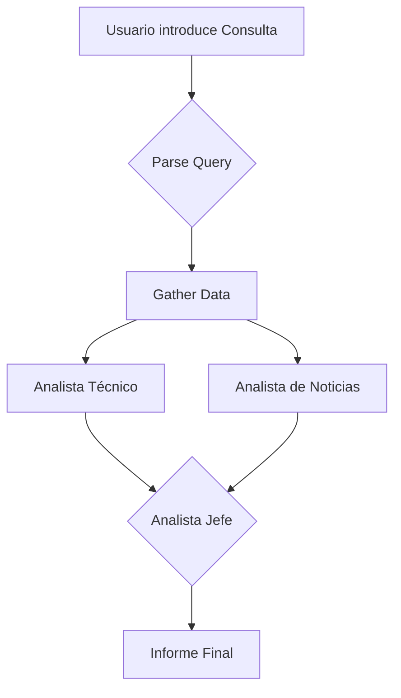

#  DeepAgents Stock Advisor

Un asistente de análisis de acciones multi-agente que utiliza LangGraph para orquestar a un equipo de especialistas de IA y generar informes de inversión.

## ✨ Características Principales

- **Arquitectura Multi-Agente:** Un equipo de agentes especializados (Técnico, Noticias) colabora bajo la dirección de un Analista Jefe.
- **Flujo de Trabajo Orquestado:** Utiliza LangGraph para un flujo de análisis transparente y robusto: Parseo -> Recopilación de Datos -> Análisis en Paralelo -> Síntesis Final.
- **⚡ Sistema de Caché Inteligente:** Almacena datos históricos en SQLite para reducir latencia de 3-5s a <500ms en consultas recurrentes.
- **🚀 Paralelización Real:** Obtención simultánea de datos de mercado, indicadores técnicos y noticias (60% más rápido).
- **📊 Indicadores Técnicos Avanzados:** SMA (20/50/200), RSI, MACD, Bandas de Bollinger, ATR y análisis de volatilidad.
- **🧠 Análisis de Sentimiento con FinBERT:** Modelo especializado en análisis de sentimiento financiero para noticias.
- **Interfaz de Usuario Sencilla:** Una interfaz web creada con Gradio para una interacción fácil y directa.

## 🏗️ Arquitectura del Sistema

El sistema sigue un flujo de trabajo definido por un grafo, donde cada nodo representa un paso en el proceso de análisis.



1.  **Parse Query:** Extrae el símbolo bursátil de la consulta.
2.  **Gather Data:** Recopila datos de mercado, indicadores técnicos y noticias.
3.  **Análisis en Paralelo:** Los agentes Técnico y de Noticias analizan los datos simultáneamente.
4.  **Síntesis:** El Analista Jefe integra los informes de los especialistas para crear una recomendación final.

---

## 🚀 Cómo Empezar

Sigue estos pasos para ejecutar la aplicación en tu entorno local.

### Requisitos Previos

- Python 3.9+
- Un modelo de lenguaje accesible a través de [Ollama](https://ollama.com/).

### Paso 1: Clonar el Repositorio

```bash
git clone <URL-del-repositorio>
cd deepagents
```

### Paso 2: Crear y Activar el Entorno Virtual

Es una buena práctica aislar las dependencias del proyecto.

**En Windows (PowerShell):**
```powershell
python -m venv .venv
.\.venv\Scripts\Activate.ps1
```

**En macOS / Linux:**
```bash
source .venv/bin/activate
```

### Paso 3: Instalar las Dependencias

```bash
pip install -r requirements.txt
```

### Paso 4: Configurar las Variables de Entorno

Necesitas configurar tus claves de API y los modelos a utilizar. El sistema utiliza Tavily Search para la búsqueda de noticias.

1.  Crea un archivo `.env` en la raíz del proyecto con el siguiente contenido:
    ```bash
    # API Keys
    TAVILY_API_KEY=tu_api_key_aqui
    
    # Model Configuration
    MODEL_PROVIDER=ollama
    OLLAMA_MODEL=deepseek-r1:8b
    MODEL_TEMPERATURE=0
    
    # Mock Configuration (para desarrollo/testing)
    USE_MOCK_NEWS=false
    MOCK_NEWS_SCENARIO=DEFAULT
    
    # Sentiment Analysis Export
    EXPORT_SENTIMENT_ANALYSIS=true
    SENTIMENT_EXPORT_FORMAT=all
    
    # Decision Thresholds
    ACTION_BUY_THRESHOLD=70
    ACTION_SELL_THRESHOLD=40
    DEFAULT_TICKERS=AAPL,MSFT,GOOGL,AMZN,TSLA
    ```

2.  **Configuración de API:**
    - Obtén tu clave de API de [Tavily](https://tavily.com/) y agrégala en `TAVILY_API_KEY`
    - Para desarrollo sin API, puedes usar `USE_MOCK_NEWS=true`

3.  **Configuración del Modelo:**
    - Asegúrate de que el modelo que quieres usar con Ollama está descargado:
      ```bash
      ollama pull deepseek-r1:8b
      ```
    - Puedes cambiar el modelo en la variable `OLLAMA_MODEL`

### Paso 5: Ejecutar la Aplicación

Una vez que todo está configurado, inicia la aplicación:

```bash
python main.py
```

### Paso 6: Abrir la Interfaz

El terminal te mostrará una URL local. Ábrela en tu navegador. Generalmente es:

**http://127.0.0.1:7860**

Ahora puedes introducir tus consultas y recibir los análisis del sistema de agentes.

---

## 📊 Exportación de Análisis de Sentimiento

El sistema incluye funcionalidad de **exportación automática** del análisis de sentimiento de noticias. Cada vez que se analiza una acción, los resultados detallados del análisis FinBERT se exportan en múltiples formatos.

### 🎯 Características de la Exportación

- ✅ **Exportación automática** configurableen cada análisis
- ✅ **3 formatos disponibles:** JSON, CSV, Markdown
- ✅ **Análisis por artículo:** Sentimiento individual de cada noticia
- ✅ **Scores detallados:** Probabilidades, confianza, sentiment_score
- ✅ **Agregación completa:** Score total ponderado

### 📁 Formatos de Exportación

#### 1. **JSON** (Formato estructurado)
```json
{
  "metadata": {
    "symbol": "AAPL",
    "export_timestamp": "2025-11-04T14:30:22",
    "analysis_method": "finbert"
  },
  "summary": {
    "aggregate_score": 83.18,
    "sentiment_label": "positive",
    "article_count": 5,
    "average_confidence": 0.821
  },
  "articles": [
    {
      "article_number": 1,
      "title": "Apple's new iPhone smashes sales records",
      "combined_score": 94.25,
      "title_sentiment": {
        "sentiment": "positive",
        "confidence": 0.92,
        "scores": {
          "negative": 0.02,
          "neutral": 0.06,
          "positive": 0.92
        }
      }
    }
  ]
}
```
**Ideal para:** Integración con otros sistemas, análisis programático

#### 2. **CSV** (Formato tabular)
```csv
article_number,symbol,title,combined_score,title_sentiment,title_confidence,...
1,AAPL,"Apple's new iPhone smashes...",94.25,positive,0.92,...
2,AAPL,"AAPL announces revolutionary...",91.50,positive,0.87,...
```
**Ideal para:** Excel, análisis estadístico, visualizaciones

#### 3. **Markdown** (Formato legible)
```markdown
# 📊 Análisis de Sentimiento de Noticias: AAPL

## 📈 Resumen Agregado
- **Score Agregado:** 83.18/100
- **Etiqueta de Sentimiento:** POSITIVE
- **Artículos Analizados:** 5
- **Confianza Promedio:** 0.821

**Interpretación:** 🟢 MUY POSITIVO - Noticias favorables dominan

## 📰 Análisis Detallado por Artículo
### Artículo 1
**Título:** Apple's new iPhone smashes sales records
...
```
**Ideal para:** Reportes, documentación, revisión manual

### ⚙️ Configuración

**Variables de entorno (.env):**

```bash
# Activar exportación automática (true/false)
EXPORT_SENTIMENT_ANALYSIS=true

# Formato: json, csv, markdown, all
SENTIMENT_EXPORT_FORMAT=all
```

### 📂 Ubicación de Archivos

Los archivos exportados se guardan en:
```
exports/sentiment/
├── AAPL_sentiment_20251104_143022.json
├── AAPL_sentiment_20251104_143022.csv
└── AAPL_sentiment_20251104_143022.md
```

### 🧪 Probar la Exportación

Ejecuta el script de prueba:
```bash
python test_sentiment_export.py
```

Este script:
1. Obtiene noticias para AAPL (usando datos mock)
2. Analiza el sentimiento con FinBERT
3. Exporta en todos los formatos
4. Muestra un resumen de las exportaciones

### 💻 Uso Programático

```python
from app.features.sentiment_exporter import export_sentiment_analysis

# Exportar en formato JSON
export_sentiment_analysis(sentiment_data, 'AAPL', format='json')

# Exportar en todos los formatos
export_sentiment_analysis(sentiment_data, 'AAPL', format='all')

# Ver resumen de exportaciones
from app.features.sentiment_exporter import get_export_summary
summary = get_export_summary()
print(f"Total archivos: {summary['total_exports']}")
```

### 📈 Utilidad para el TFM

La exportación de datos permite:
- **Auditoría:** Verificar resultados del análisis de sentimiento
- **Backtesting:** Analizar precisión histórica de predicciones
- **Visualizaciones:** Crear gráficos de evolución del sentimiento
- **Investigación:** Estudiar correlación entre sentimiento y movimientos de precio

---

## 🚨 Disclaimer

Esta herramienta es solo para fines educativos y de investigación. No constituye asesoramiento financiero. Consulta siempre a asesores financieros cualificados antes de tomar decisiones de inversión.